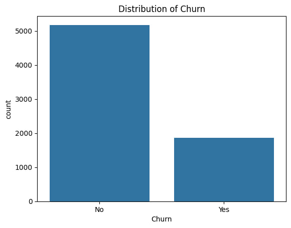
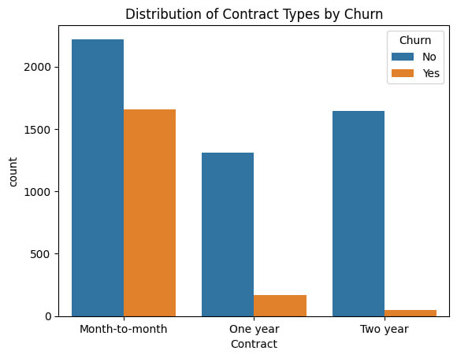
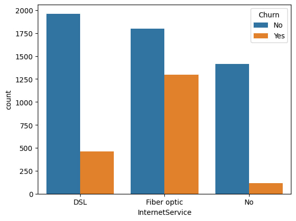
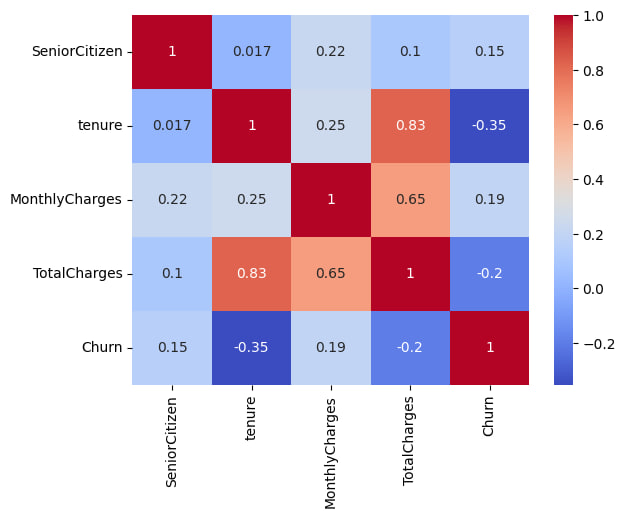
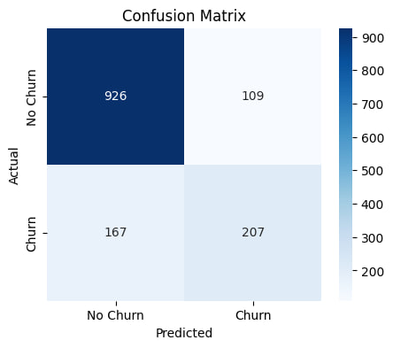
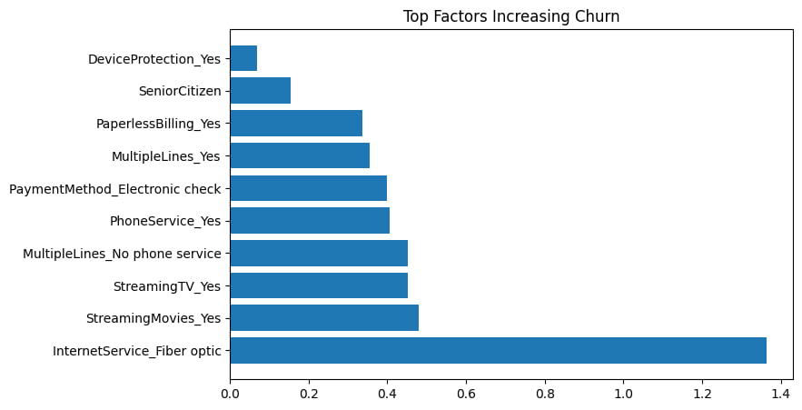
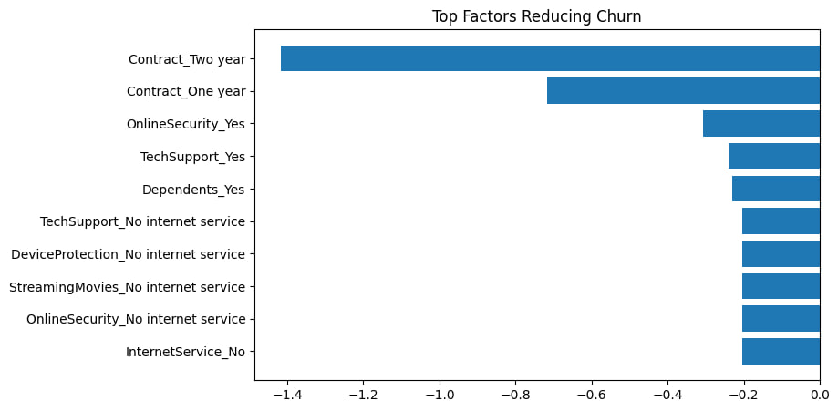
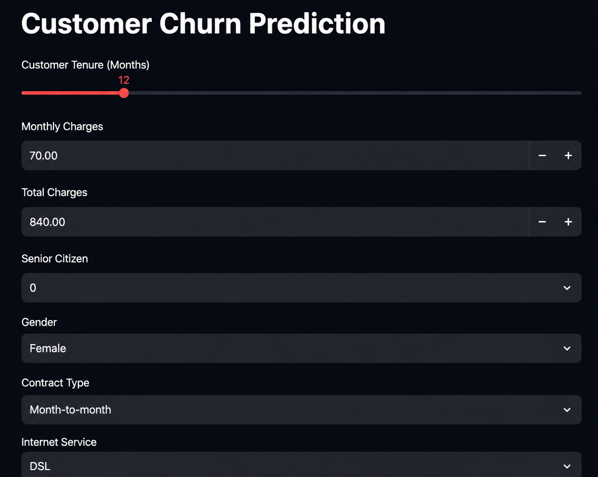
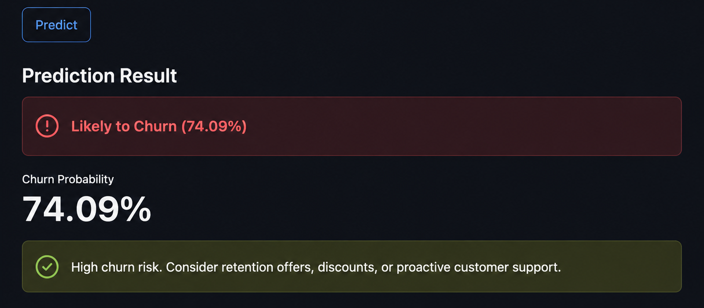

# Customer Churn Prediction Platform

## Project Overview

This project predicts whether a telecom customer is likely to churn using Machine Learning. The solution includes data preprocessing, exploratory data analysis, feature engineering, model training, model explainability, model optimization, and deployment through a Streamlit web application.

The objective is to help telecom companies identify customers at risk of leaving and take proactive retention measures.

## Live Demo

🔗 Streamlit App:
https://customer-churn-prediction-platform-xcbsdvu6bwhmsvde8vsv55.streamlit.app/

🔗 GitHub Repository:
https://github.com/KunduruPavankumarreddy/customer-churn-prediction-platform

## Project Highlights

- Built an end-to-end Customer Churn Prediction Platform.
- Performed data cleaning, EDA, feature engineering, and model optimization.
- Evaluated Logistic Regression, Random Forest, and XGBoost models.
- Improved churn recall through class balancing and hyperparameter tuning.
- Used SHAP for model explainability.
- Developed an interactive Streamlit application for real-time churn prediction.
- Achieved 77% accuracy and 74% recall using an Optimized Random Forest model.

## Technologies Used

* Python
* Pandas
* NumPy
* Scikit-Learn
* XGBoost
* Matplotlib
* Seaborn
* SHAP
* Streamlit
* Joblib

---

## Dataset

**Dataset:** Telco Customer Churn Dataset

* Rows: 7043
* Original Features: 21
* Processed Features: 31

Target Variable:

* Churn (Yes/No)

---

## Project Workflow

1. Data Cleaning
2. Exploratory Data Analysis (EDA)
3. Feature Engineering
4. Model Training
5. Model Explainability
6. Model Optimization
7. Streamlit Deployment

---

## Exploratory Data Analysis

### Churn Distribution



**Insight:**

* Most customers did not churn.
* The dataset is imbalanced, making churn prediction more challenging.

### Contract Type vs Churn



**Insight:**

* Month-to-month customers showed the highest churn rates.
* Long-term contracts significantly reduced churn.

### Internet Service vs Churn



**Insight:**

* Fiber optic customers exhibited higher churn rates.
* Internet service type strongly influences customer retention.

### Correlation Heatmap



**Insight:**

* Contract type, tenure, and online security showed strong relationships with churn.

---

## Feature Engineering

The following preprocessing steps were applied:

* Removed unnecessary columns
* Handled missing values
* Converted categorical variables using One-Hot Encoding
* Created 31 model-ready features
* Saved processed dataset for model training

### Final Dataset Shape

```text
7043 rows × 31 columns
```

---

## Model Training

The following machine learning models were evaluated:

* Logistic Regression
* Balanced Logistic Regression
* Random Forest
* XGBoost
* Optimized Random Forest

### Confusion Matrix



**Insight:**

* The model correctly identified most non-churn customers.
* Optimization techniques improved churn customer detection.

---

## Model Explainability

SHAP (SHapley Additive exPlanations) was used to understand the factors influencing churn predictions.

### Top Factors Increasing Churn



### Top Factors Reducing Churn



### Key Findings

* Fiber optic internet increases churn risk.
* Month-to-month contracts increase churn risk.
* Two-year contracts significantly reduce churn.
* Online security improves customer retention.
* Technical support reduces churn probability.

---

## Model Optimization

Optimization techniques applied:

* Class weighting
* Hyperparameter tuning
* Threshold tuning
* Recall improvement strategies

### Model Comparison Summary

| Model                        | Accuracy | Recall | F1 Score |
| ---------------------------- | -------- | ------ | -------- |
| Logistic Regression          | 80%      | 55%    | 60%      |
| Balanced Logistic Regression | 74%      | 79%    | 62%      |
| Random Forest                | 79%      | 49%    | 56%      |
| XGBoost                      | 78%      | 53%    | 57%      |
| Optimized Random Forest      | 77%      | 74%    | 63%      |

### Final Selected Model

**Optimized Random Forest**

| Metric    | Value |
| --------- | ----- |
| Accuracy  | 77%   |
| Precision | 54%   |
| Recall    | 74%   |
| F1 Score  | 63%   |

### Reason for Selection

* Achieved the best balance between accuracy and churn detection.
* Maintained strong recall performance.
* Produced the highest overall F1 score.
* Suitable for real-world customer retention use cases.

### Deployment Model

The optimized Random Forest model was saved as **churn_model_v2.pkl** and deployed in the Streamlit application for real-time churn prediction.
---

## Streamlit Application

The project was deployed using Streamlit to provide an interactive user interface for churn prediction.

### Input Screen



### Prediction Output



Features:

* User-friendly interface
* Real-time churn prediction
* Churn probability score
* Risk-level interpretation
* Business recommendations based on prediction results

---

## Results

* Built an end-to-end Customer Churn Prediction Platform.
* Achieved 77% prediction accuracy.
* Improved churn recall to 74% through model optimization.
* Identified key churn drivers using SHAP explainability.
* Developed an interactive Streamlit application for real-time predictions.

---

## Future Improvements

* Deploy application to Streamlit Cloud
* Integrate real-time customer data
* Implement automated model retraining
* Explore advanced ensemble methods
* Improve recall through further hyperparameter optimization
* Add monitoring and drift detection for production deployment

---

## Author

Pavan Kunduru

Aspiring Data Scientist | Machine Learning Enthusiast
